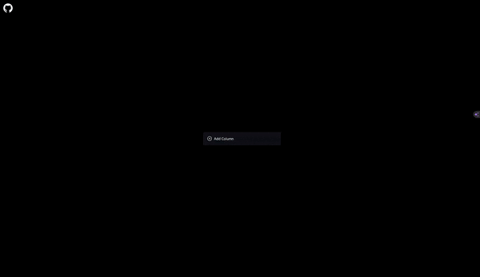
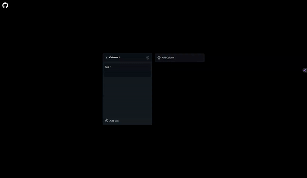

# My Kanban
## Introduction
This app I created as a fully functional Kanban app you can use to keep track of your own work.
The App lets you create columns and rename them to however you want to organize your tasks.
You can create as many tasks as you want. The app also has a built-in pomodoro app you can use to time yourself finishing a task

## Features
### Saving
Your tasks are saved in local storage of the browser. So you can always come back and pick off where you left off.

### Pomodoro Timer
You can click on the timer button for a task to launch the pomodoro timer. The pomodoro timer will hepl track how time you have to spend to finish the task.

## Enough let me play with it!
You can find the fully functioning deployed app here: https://my-kanban-woad.vercel.app

## See more
If you liked my project then you can see more on my portfolio website: https://portfolio-next-theta-self.vercel.app